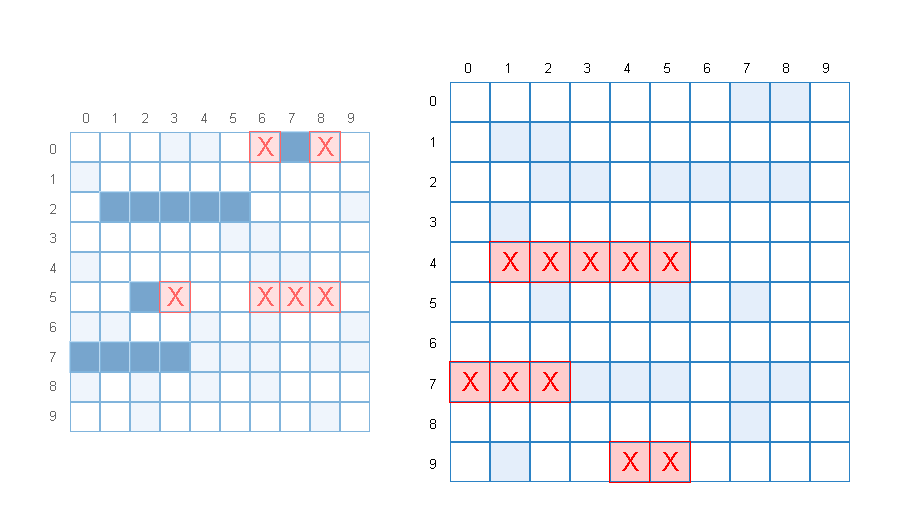

# battleship

Battleship project for The Odin Project. Made with HTML, CSS, and Javascript.

## Demo

[Live Preview](https://nevz9.github.io/battleship/)

## Screenshots

## Lessons Learned

I learned a lot about Test Driven Development. It greatly helps with the logic and how we write our code, based on the tests. As a result we will encounter lesser bugs. It was definitely a learning experience, although I'm still not confident with it as I got used to logging everything in the console and using the debugger.

## Acknowledgements

- [The Odin Project](https://www.theodinproject.com/)
- [Design Inspiration](http://en.battleship-game.org/)

## TODO

- Ships Factory
  - [x] ship array
  - [x] hit function
  - [x] isSunk function
  - [x] getShip function
  - [x] getNonHitPositions function
- Gameboard Factory
  - [x] board array
  - [x] place ship function
    - [x] occupy space in the board
    - [x] check board edges
    - [x] auto ship placement
  - [x] check win/lose condition
  - [ ] be able to place ships vertically
- Players
  - [ ] pure turn based
    - [x] be able to take turns
  - [ ] create AI
    - [x] be able to do random plays
      - [x] not attack the same coordinates
    - [x] only valid moves
    - [ ] smart ai
- DOM
  - [x] create 10x10 board
  - [x] add ships to deploy
  - [ ] add announcer
  - [x] add styling
    - [x] small animations/effects
      - [x] fix specificity issues
  - [x] create event handlers
  - [ ] whole code base refactor/perf optimization
